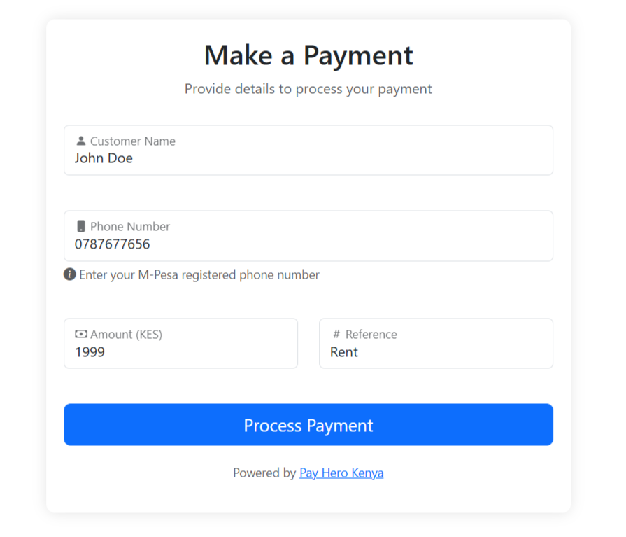

# PayHero Payment Integration Setup Guide


This comprehensive guide will help you integrate PayHero's payment system into your website, allowing you to accept payments directly to your PayHero wallet or linked payment channels.

## Demo

A live demo of the PayHero payment integration can be seen at [https://applet.payherokenya.com/deposit/](https://applet.payherokenya.com/deposit/)


## Prerequisites

Before you begin the integration, you'll need to:

1. Create a PayHero account by visiting [https://app.payhero.co.ke](https://app.payhero.co.ke)
2. Complete the account verification process
3. Log in to your verified account
4. Generate your API credentials from the developer section

## Getting Your API Credentials

1. After logging into your PayHero account:
   - Navigate to the Menu
   - Go to "API Keys"
   - Generate a new API key if you haven't already
   - Copy your API username and password
   - Generate your Basic Auth Token using the code below (or equivalent in your preferred language):
     ```php
     <?php
     // Your API username and password 
     $apiUsername = 'your_username';
     $apiPassword = 'your_password';
     // Concatenating username and password with colon
     $credentials = $apiUsername . ':' . $apiPassword;
     // Base64 encode the credentials
     $encodedCredentials = base64_encode($credentials);
     // Creating the Basic Auth token
     $basicAuthToken = 'Basic ' . $encodedCredentials;
     // Output the token
     echo $basicAuthToken;
     ?>
     ```
   - Use the generated Basic Auth Token in your configuration

## Real-Time Payment Integration

This integration allows you to:
- Accept M-Pesa and SasaPay payments
- Get real-time payment status updates
- Automatically redirect users after successful/failed payments
- Receive webhook notifications for payment events

## Configuration Steps

1. Open the `config.php` file and update the following configuration with your PayHero account details:

   ```php
   $paymentConfig = [
       "channelId"=> 100,        // Your PayHero wallet/channel ID (found in your dashboard)
       "provider"=> "m-pesa",    // Payment provider options: "m-pesa" or "sasapay"
       "networkCode"=> "63902",  // Network code (63902 for Safaricom M-Pesa, do not change)
       "callbackUrl"=> "",       // (Optional) Your webhook URL to receive payment notifications
       "credentialId"=> null,    // (Optional) Custom credential ID if provided by PayHero support
       "basicAuthToken"=> "",    // Your Basic Auth Token from PayHero developer section
       "successURL"=> null,      // (Optional) URL where users are redirected after successful payment
       "failedURL"=> null        // (Optional) URL where users are redirected after failed payment
   ];
   ```

Note: Make sure to keep your `basicAuthToken` secure and never expose it in public repositories or client-side code.
